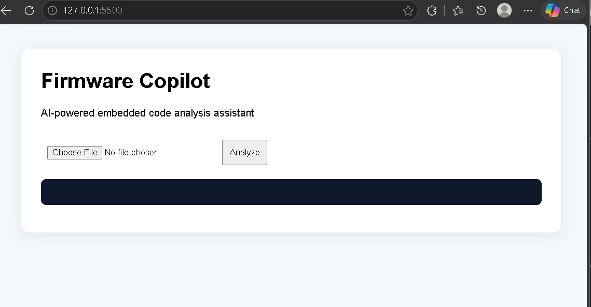
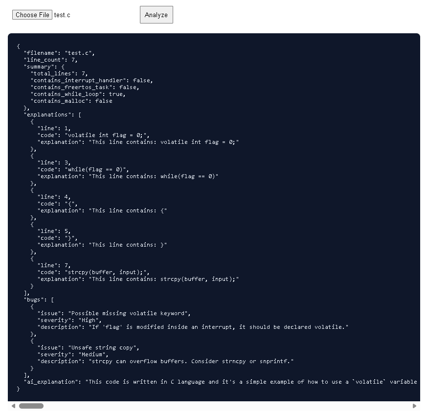
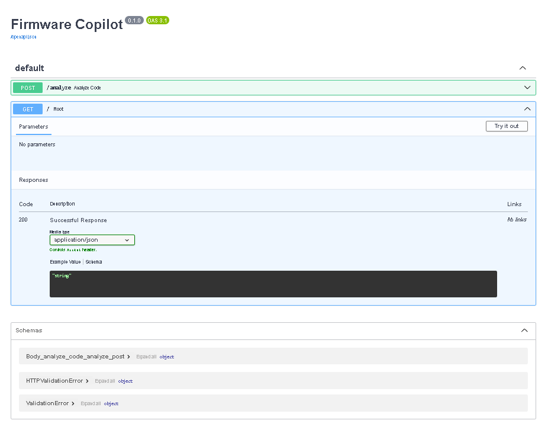

# 🔧 Firmware Copilot

> AI-powered embedded firmware analysis assistant that explains code, detects common firmware bugs, and helps developers understand complex embedded systems code.


---

## 🚀 Overview

Firmware Copilot is an AI-assisted developer tool designed for embedded systems engineers.

It analyzes firmware source code and provides:

* 📖 Beginner-friendly code explanations
* 🐛 Detection of common embedded firmware bugs
* 📊 Repository/code summaries
* 🤖 AI-generated explanations using Large Language Models

This project was originally built for the IBM Bob Hackathon and demonstrates the intersection of:

* Embedded Systems
* AI/LLMs
* Developer Tooling
* FastAPI Backend Development

---

## 🎯 Problem Statement

Firmware development is challenging because:

* Bugs are difficult to debug
* Hardware interactions are complex
* Race conditions are subtle
* Memory constraints are strict
* Codebases are hard for beginners to understand

Traditional static analysis tools are often generic and do not explain issues in beginner-friendly terms.

---

## 💡 Solution

Firmware Copilot allows users to upload Embedded C/C++ source files and receive:

### ✅ Code Summary

* Total lines of code
* Presence of interrupts
* FreeRTOS usage
* Dynamic memory usage

### 🐛 Bug Detection

Examples:

* Missing `volatile`
* Unsafe `strcpy()`
* Dynamic memory allocation warnings

### 📖 Line-by-Line Explanation

Simple explanations for each code line.

### 🤖 AI Explanation

Detailed natural-language explanation generated using a coding LLM.

---

## 🏗️ Architecture

```text
Frontend (HTML/CSS/JavaScript)
        ↓
FastAPI Backend
        ↓
Analysis Pipeline
 ├── Repository Analyzer
 ├── Bug Detector
 ├── Code Explainer
 └── AI Explainer
        ↓
Hugging Face Inference API
```

---

## ✨ Features

* Upload `.c`, `.h`, `.cpp`, `.hpp`, and `.py` files
* Detect embedded-specific bugs
* Explain code line-by-line
* Generate AI explanations
* REST API with Swagger docs
* Simple browser-based frontend

---

## 🛠️ Tech Stack

### Backend

* Python 3.10+
* FastAPI
* Uvicorn
* python-dotenv
* Hugging Face Hub

### Frontend

* HTML
* CSS
* JavaScript

### AI Models

* Qwen2.5-Coder-7B-Instruct (default)
* Other Hugging Face-compatible models

### Tools Used

* VS Code + WSL Ubuntu
* Git & GitHub
* IBM Bob IDE

---

## 📂 Project Structure

```text
firmware-copilot/
├── app/
│   ├── main.py
│   ├── routes/
│   │   └── analyze.py
│   └── services/
│       ├── ai_explainer.py
│       ├── bug_detector.py
│       ├── code_explainer.py
│       └── repo_analyzer.py
├── frontend/
│   ├── index.html
│   ├── style.css
│   └── script.js
├── uploads/
├── bob_sessions/
├── README.md
├── requirements.txt
├── .env.example
└── .gitignore
```

---

## ⚙️ Installation

### 1. Clone the Repository

```bash
git clone https://github.com/YOUR_USERNAME/firmware-copilot.git
cd firmware-copilot
```

### 2. Create Virtual Environment

```bash
python3 -m venv venv
source venv/bin/activate
```

### 3. Install Dependencies

```bash
pip install -r requirements.txt
```

### 4. Create `.env`

```env
HF_TOKEN=your_hugging_face_token
MODEL_NAME=Qwen/Qwen2.5-Coder-7B-Instruct
```

### 5. Run Backend

```bash
uvicorn app.main:app --reload --port 8001
```

### 6. Run Frontend

```bash
cd frontend
python3 -m http.server 5500
```

### 7. Open Browser

* Backend Docs: `http://127.0.0.1:8001/docs`
* Frontend: `http://127.0.0.1:5500`

---

## 🧪 Example Input

```c
volatile int flag = 0;

while(flag == 0)
{
}

strcpy(buffer, input);
```

---

## 📤 Example Output

### Bugs Detected

* Possible missing volatile keyword
* Unsafe string copy

### AI Explanation

* Explains why `volatile` is required
* Describes busy-wait loop behavior
* Warns about `strcpy()` buffer overflow risk

---

## 🌍 Use Cases

* Embedded systems education
* Firmware code reviews
* Static analysis assistance
* Beginner learning tool
* Interview preparation

---

## 📈 Future Improvements

* Support full repository/ZIP upload
* FreeRTOS-aware analysis
* PDF report generation
* Architecture diagrams
* More firmware bug patterns
* watsonx.ai integration
* CI/CD pipeline

---

## 🏆 IBM Bob Hackathon Contribution

IBM Bob IDE was used to:

* Review project architecture
* Generate a comprehensive improvement plan
* Suggest security enhancements
* Recommend hackathon submission strategies

Exported Bob sessions are stored in the `bob_sessions/` directory.

---

## 📸 Demo Screenshots

### Home Page


### Analysis Results


### API Documentation


---

## 🎥 Demo Video

> Add your demo video link here.

---

## 🚀 Deployment

Recommended deployment platforms:

* Render
* Hugging Face Spaces
* IBM Cloud

---

## 🤝 Contributing

Contributions are welcome.

1. Fork the repository
2. Create a feature branch
3. Commit changes
4. Open a pull request

---

## 👨‍💻 Author

**Tushar Kale**

* GitHub: [https://github.com/108-TusharBK](https://github.com/108-TusharBK)


---

## ⭐ Acknowledgments

* Hugging Face
* IBM Bob IDE
* FastAPI
* Open-source AI community

---

## 💼 Resume Summary

Built an AI-powered firmware analysis tool that detects embedded-specific bugs and generates beginner-friendly explanations using FastAPI, Hugging Face LLMs, and IBM Bob.
